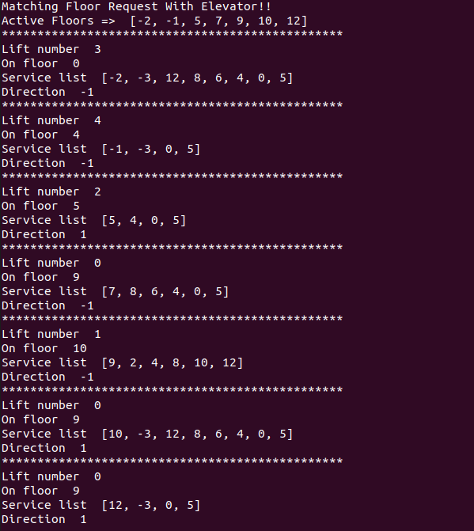
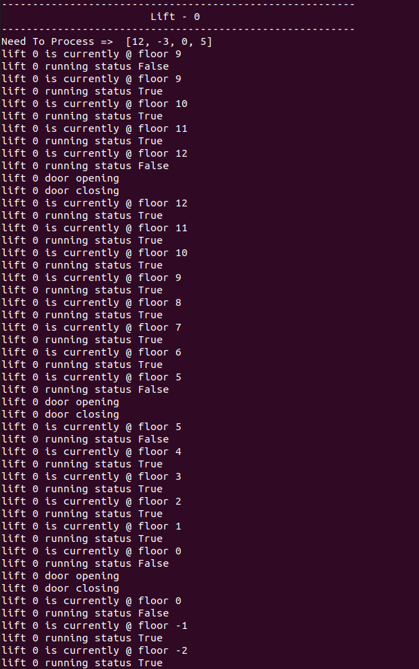

# Elevator System - Python

# Problem Solved:

- An elevator system, which can be initialized with `n` elevator.

- When provided input as below, it processes each request, based on simple cost functions.

- Input can be edited in `./code/run.py`.

- Each elevator has below capabilites :
    -  Move Up and Down
    -  Open and Close Door
    -  Start and Stop Running
    -  Display Current Status
    -  Decide weather to move up or down, given a list of request

- Elevator System takes care of :

  -   Creation of system with an array of objects of elevator.
  -   Decides which lift to associate which floor.
  -   Marks which elevator is available or busy.
  -   Can mark which elevator is operational and which is not.

# ASSUMPTION:

- Elevator System has got only one button  per elevator outside the elevator.

- So if there are a total of 5 elevators, there will be 5 buttons.

- Note that, this dosent not mimic real world, when you would have a total of 10 buttons for 5 elevators ( one for up and one for down)

- Once the elevator reaches its called point, then based on what floor is requested, it moves either up or down.

# How to Run:

1. [OPTIONAL] - Create and activate a python3 virtualenv.

2. Install requirements mentioned in `req.txt` :

    `pip install -r req.txt`

3. Change directory to code :

    `cd code`

4. [OPTIONAL] - Change the params in `./code/run.py`

5. `python run.py`

# Imporvements:

1. Error handling could be improved.

2. Take input from user / config file rather than hardcoding it.

3. Enhance system to have better cost functions.

# Default Input Details :

1. `active_floors = [5,-2,7,9,10, 9, 12, -1]` - List of floors on which button outside elevator was pressed.

2. `lift_positions = [9,10,5,0,4]` - Current elevator postion, this represents  5 elevator currently standing @ floor 9, 10, 5, 0 and 4.

3. `no_of_lifts, floor_min, floor_max = 5, -4, 20` - Number of lifts in the system, min floor, max floor

4. `request_each` = [[-3,12, 8, 6 ,4 ,0, 5], [-3,0, 5],
      [4,0, 5],
      [8, 6 ,4 ,0, 5],
      [2,4,8,10,12]]

  A 2d list to mimic buttons pressed / request to go in each elevator.

# Output of Default Input:
- [Output cropped].

